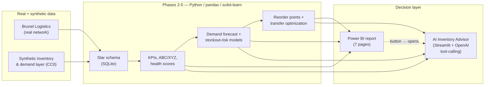
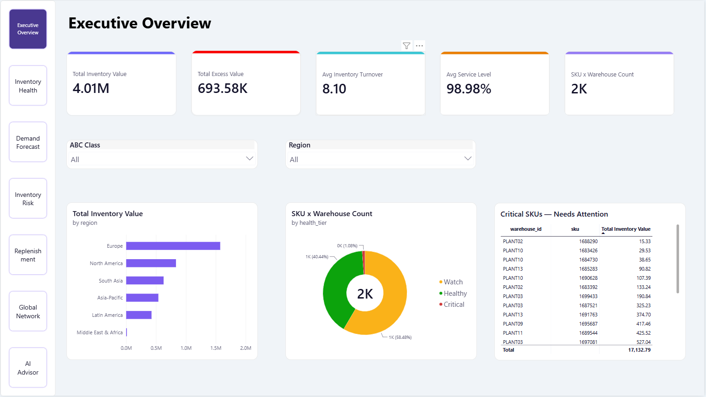
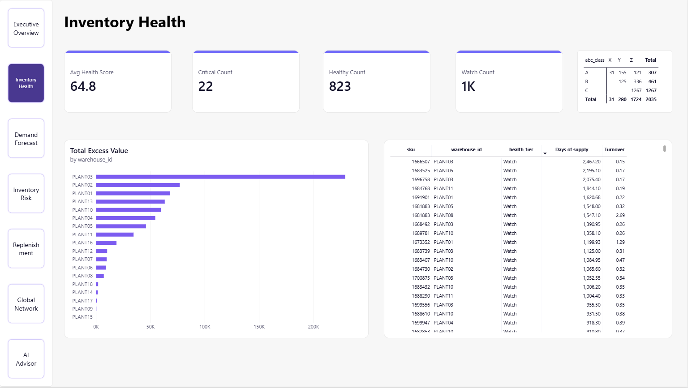
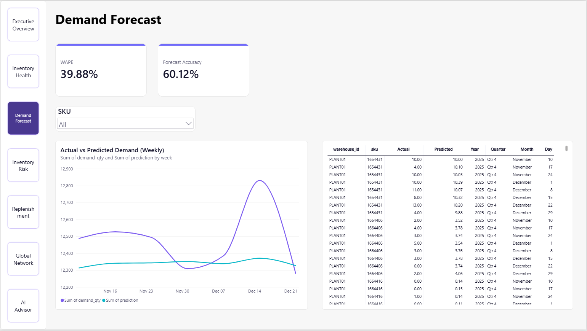
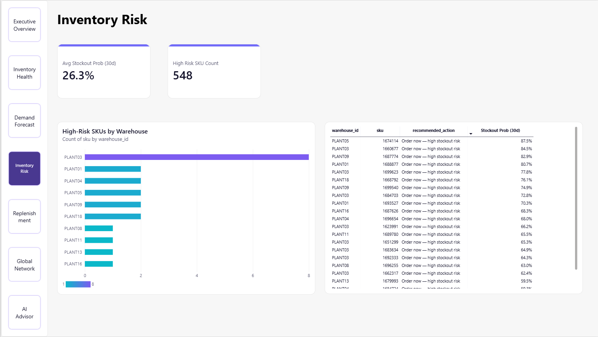
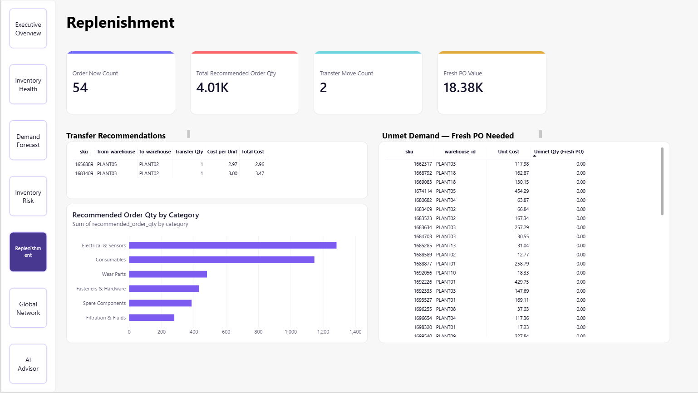
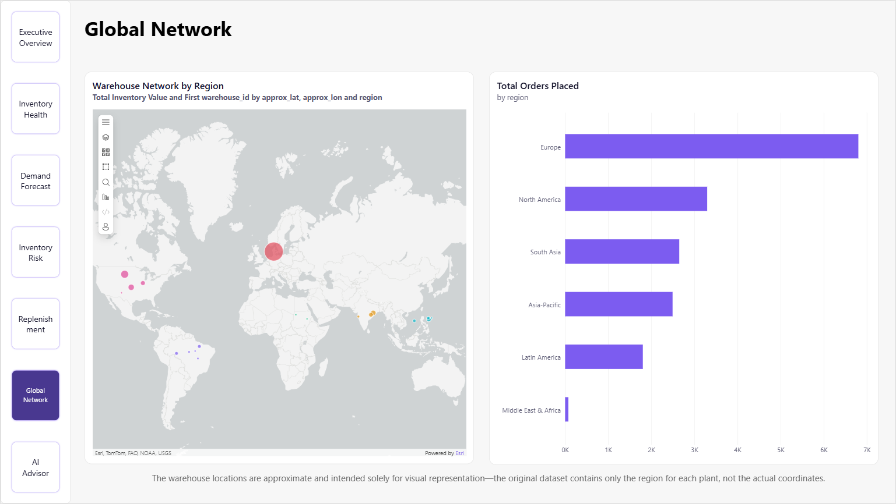
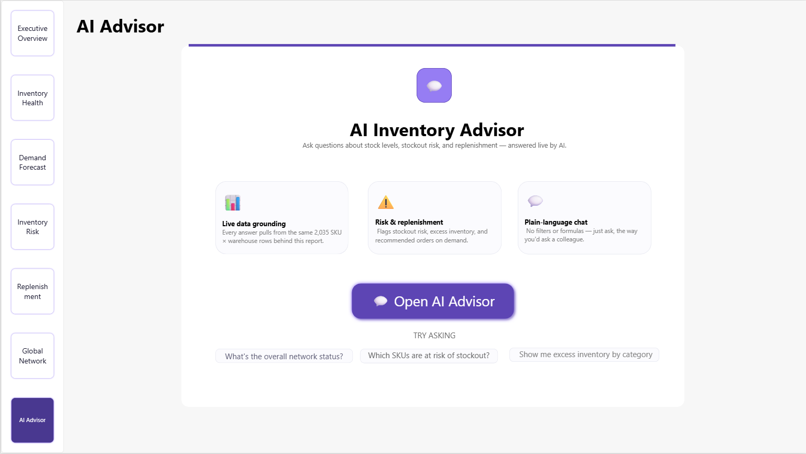

# AI-Powered Inventory Performance & Optimization — Global Industrial Supply Chain

A portfolio project that takes one inventory network through the full
analytics stack — descriptive, diagnostic, predictive, prescriptive — into
a live Power BI decision dashboard and a generative-AI advisor anyone can
question in plain language. Simulated global industrial aftermarket network
(parts/consumables, in the spirit of a company like Metso's Consumables
business).

**🔗 Try the AI Inventory Advisor live:** **[inventory-intelligence-gsc...streamlit.app](https://inventory-intelligence-gsc-zvihgneewhukdgh6qdfotq.streamlit.app/)**
— no login, no API key needed, ask it anything about the network below.

**Status:** all 8 phases complete. See [`docs/ROADMAP.md`](docs/ROADMAP.md)
for the phase-by-phase build plan.

## Why this project

Most public "supply chain analytics" portfolio pieces reuse the same one
dataset (DataCo) without checking its license, and stop at exploratory
dashboards or a single classifier. This project instead:

1. Starts from a **real, multi-plant / multi-warehouse / multi-port
   logistics network** (Brunel University London's Supply Chain Logistics
   Problem Dataset) rather than an unlicensed mirror.
2. Adds a **transparently synthetic, self-owned inventory & demand layer**
   calibrated to that real network, because no public dataset combines
   real on-hand stock levels with industrial-network structure — see
   [`docs/DATA_PROVENANCE.md`](docs/DATA_PROVENANCE.md) and
   [`docs/SYNTHETIC_DATA_METHODOLOGY.md`](docs/SYNTHETIC_DATA_METHODOLOGY.md)
   for exactly how and why.
3. Chains together forecasting → stockout risk → inventory health scoring →
   optimization (reorder points / excess-transfer planning) → an
   interactive Power BI report → an AI advisor that explains the results
   in plain language — instead of stopping at EDA.
4. Documents every real limitation it hits along the way (a freight-rate
   dataset that turned out unsuitable for transfer costing, model
   explanations that couldn't be persisted, a public-deployment platform
   restriction) rather than quietly working around them off-screen. See
   "Honest limitations" below.

## Architecture



The Power BI report and the AI Advisor read the **same** processed tables —
nothing in the chatbot is a separate or re-derived source of truth. A button
on the report's "AI Advisor" page opens the live chatbot in a browser tab
(see [why not an embedded iframe](docs/AI_ADVISOR_DESIGN.md#public-deployment)).

## Key results

| Metric | Value |
|---|---|
| Network | 19 warehouses/plants, 1,540 SKUs, 2,035 SKU×warehouse combinations |
| Total inventory value | $4.01M |
| Excess inventory value | $693.6K (569 SKU×warehouse rows flagged excess) |
| Health tiers | 823 Healthy · 1,190 Watch · 22 Critical |
| Avg. service level | 98.98% |
| Avg. inventory turnover | 8.1x/yr |
| Demand forecast accuracy | WAPE 33.8% (see "Honest limitations" — this is reported, not smoothed over) |
| Open replenishment actions | 54 SKU×warehouse rows need a fresh PO now |
| Prescriptive transfer plan | 2 units transferable network-wide; $18.4K of shortage has no matching excess elsewhere and correctly routes to a fresh PO instead of an invented transfer |

## Power BI report

Seven pages: Executive Overview, Inventory Health, Demand Forecast,
Inventory Risk, Replenishment, Global Network, and AI Advisor. The `.pbix`
itself isn't versioned (Power BI Desktop required to open it, and it can
get large with the full 1.5M-row fact tables) — rebuild it from
`data/powerbi/` + [`docs/POWERBI_BUILD_GUIDE.md`](docs/POWERBI_BUILD_GUIDE.md).
Screenshots of every page:

| | |
|---|---|
|  |  |
|  |  |
|  |  |
|  | |

## AI Inventory Advisor

A Streamlit chat app backed by OpenAI tool-calling — 12 Python functions
that read the project's own processed tables (never a free-text guess), so
every number the Advisor states is traceable back to a real
`data/processed/` file. Deployed publicly on Streamlit Community Cloud so
anyone with the Power BI report (or this README) can use it, no API key of
their own required. Full design writeup: [`docs/AI_ADVISOR_DESIGN.md`](docs/AI_ADVISOR_DESIGN.md).

Example questions it handles well:

- "How's the network doing overall?"
- "Why is inventory so high at PLANT03?"
- "Why has network inventory dropped over the last few months?" (charts the trend, not just describes it)
- "Which SKUs have the highest stockout risk right now?"
- "What's the transfer plan, and what still needs a fresh PO?"

## Repository layout

```
data/
  raw/                  third-party source data, as downloaded (see docs/DATA_PROVENANCE.md)
  synthetic/             this project's own generated inventory/demand layer (CC0)
  processed/              cleaned, modeled tables ready for analysis / Power BI / the AI Advisor
notebooks/               numbered, run-in-order Jupyter/Colab notebooks (Phases 1-6)
src/                      reusable Python modules imported by the notebooks
  ai_advisor/             Phase 7 — data access, tools, OpenAI agent loop
app.py                    Phase 7 — the AI Advisor's Streamlit entry point
powerbi/                  DAX reference and build guide (the .pbix itself isn't versioned — see above)
docs/                     roadmap, data provenance, methodology, design docs, write-up, screenshots
```

## Getting started

```bash
python -m venv .venv && source .venv/bin/activate
pip install -r requirements.txt
jupyter lab notebooks/01_data_acquisition.ipynb
```

Or open any notebook in `notebooks/` directly in Google Colab — each one
downloads its own source data on first run. To run the AI Advisor locally
instead of using the public deployment:

```bash
pip install -r requirements.txt
export OPENAI_API_KEY=sk-...          # PowerShell: $env:OPENAI_API_KEY="sk-..."
streamlit run app.py
```

## Honest limitations

This project documents its real limitations rather than hiding them —
see each linked doc for the full reasoning:

- **Forecast accuracy (WAPE 33.8%)** is reported as-is. The demand series
  is synthetic and intentionally noisy; a production forecast against real
  ERP demand history would be expected to do meaningfully better, but this
  project doesn't inflate the number to look good. (An earlier version of
  the model — plain regression objective, a fixed round count — scored
  WAPE 40.9%; switching to a Tweedie objective, suited to this demand
  series' zero-inflation, plus early stopping against a held-out
  validation window instead of a guessed fixed round count, improved this
  to 39.9%. A separate boundary bug was then found and fixed: the raw
  daily data ends mid-week, so the last weekly test bucket was silently
  being built from 3 days of demand instead of 7, inflating WAPE for every
  method equally; excluding that incomplete trailing week brought the
  reported number to 33.8%, without changing any features or
  hyperparameters. A monthly-granularity version of this same model,
  built for cases where weekly noise isn't the right lens, reaches 17.2%
  WAPE — see the project writeup for why the two aren't directly
  comparable.)
- **Transfer costing is illustrative**, not derived from the real Brunel
  freight-rate data — that dataset turned out to record rates for a single
  hub port, unsuitable for a general inter-warehouse cost matrix. Documented
  in [`docs/SYNTHETIC_DATA_METHODOLOGY.md`](docs/SYNTHETIC_DATA_METHODOLOGY.md).
- **`explain_health_score` is a transparent rule-based decomposition, not
  real SHAP** — the Phase 4 models' SHAP values were computed at training
  time but the models themselves were never serialized to disk, so the
  Advisor can't re-load them live. Documented in
  [`docs/AI_ADVISOR_DESIGN.md`](docs/AI_ADVISOR_DESIGN.md).
- **The Power BI "AI Advisor" page links out to the chatbot rather than
  embedding it** — Power BI Desktop doesn't render `<iframe>` content in
  any custom visual, a platform restriction with no workaround for a
  `.pbix` shared as a file. Documented in
  [`docs/AI_ADVISOR_DESIGN.md`](docs/AI_ADVISOR_DESIGN.md#public-deployment).
- **Warehouse map coordinates are illustrative** (region-center + jitter)
  — the source data records a region per plant, not real coordinates.

A one-page write-up (problem → approach → what a real-ERP version would
need) is at [`docs/WRITEUP.md`](docs/WRITEUP.md).

Full dataset audit, license teardown, and scoring of 10 public candidates
considered before choosing this one: see the companion **Inventory
Intelligence Sourcebook**.

## License

Code in this repository: MIT (see `LICENSE`). Third-party datasets keep
their original licenses (see `docs/DATA_PROVENANCE.md`); this project's own
synthetic data is CC0.
